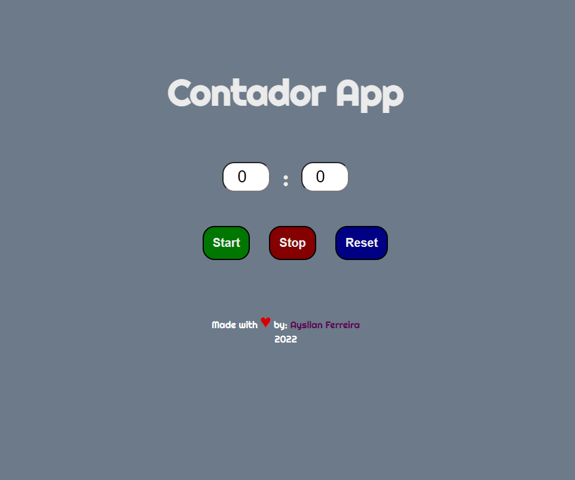

# Contador App

Este projeto foi desenvolvido por Aysllan Ferreira, enquanto estudante na Trybe, com o propósito de cumprir um desafio e também praticar as habilidades em React. <br> <br>
[Link do Projeto](https://contador-app.vercel.app/)

# Orientações

<details>
<summary><strong>‼ Como rodar</strong></summary><br />

1. Clone o repositório

	*  Use o comando: `git@github.com:aysllanferreira/contador-app.git`

* Entre na pasta do repositório que você acabou de clonar:

	*  `cd contador-app`

2. Instale as dependências

	* Para isso, use o seguinte comando: `npm install`

3. Para rodar localmente na sua máquina, rode no seu terminal o comando:  
```bash
npm run dev
```
</details>
<br>

# Imagem do Projeto

